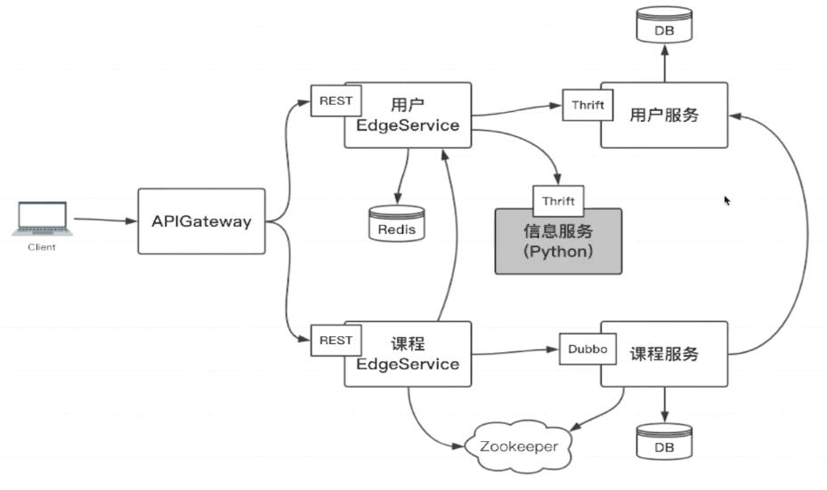
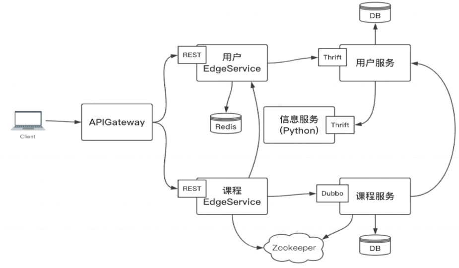

# backend-devops-learning

# 用户服务

- 用户登录
- 用户注册
- 用户基本信息查询
- 无状态，无session
- 单点登录

```bash
[emon@emon ~]$ mkdir -pv /usr/local/dockerv/mysql_home/{conf,data}
[emon@emon ~]$ vim /usr/local/dockerv/mysql_home/conf/my.cnf
```

```text
[mysqld]
character-set-server=utf8mb4

[client]
default-character-set=utf8mb4

[mysql]
default-character-set=utf8mb4
```

```bash
docker rm -f devops-mysql
docker run --name devops-mysql -v /usr/local/dockerv/mysql_home/conf:/etc/mysql/conf.d \
-v /usr/local/dockerv/mysql_home/data:/var/lib/mysql -p 3306:3306 \
-e MYSQL_ROOT_PASSWORD=root123 -d mysql:5.7.37 
```

# 课程服务

- 登录验证
- 课程的curd

# 信息服务

- 发送邮件
- 发送短信

## 依赖说明

- 本地需要安装thrift，用于编译成各种语言的代码
- 本地还需要引入各种语言的thrift包，如下thrift的python版

```bash
$ python -m pip install thrift
```

- java版本

```xml

<dependency>
    <groupId>org.apache.thrift</groupId>
    <artifactId>libthrift</artifactId>
    <version>0.16.0</version>
</dependency>
```

# 用户 EdgeService

```bash
[emon@emon ~]$ mkdir -p /usr/local/dockerv/redis_home/data
[emon@emon ~]$ cp /usr/local/redis/redis.conf  /usr/local/dockerv/redis_home/
```

```bash
docker rm -f devops-redis
docker run --name devops-redis -v /usr/local/dockerv/redis_home/data:/data \
-v /usr/local/dockerv/redis_home/redis.conf:/etc/redis/redis_default.conf -p 6379:6379 \
-itd redis:5.0.14 
```

# 课程 EdgeService
```bash
docker run --name devops-zookeeper -p 2181:2181 --restart always -d zookeeper:3.5
```

# API GATEWAY

# 课程结构图





